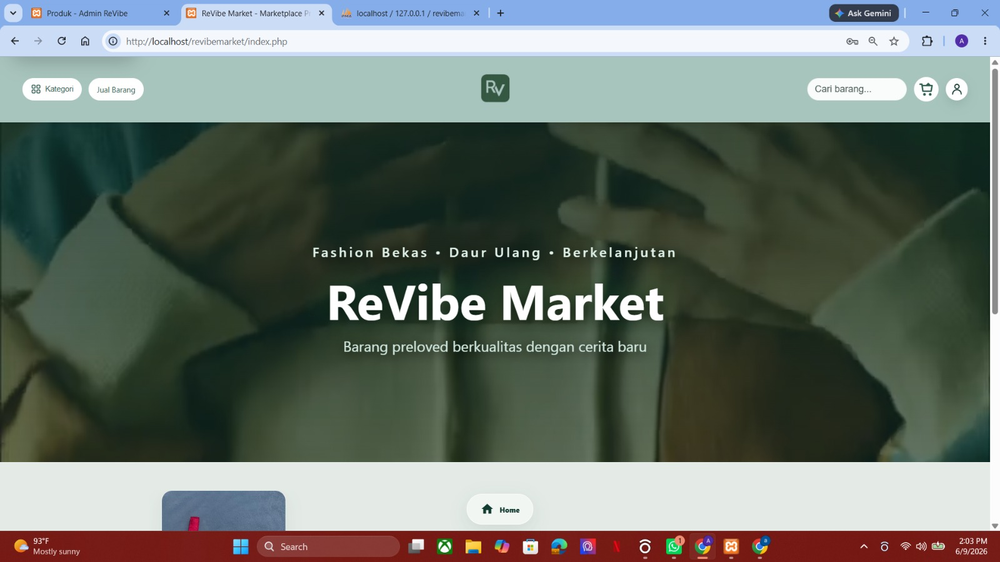
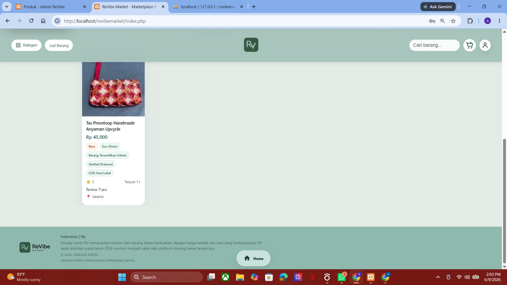

# ReVibe Market — Production Ready Marketplace

<p align="center">
  
</p>

<p align="center">
  
</p>

<p align="center">
  <a href="https://drive.google.com/drive/folders/1QyJD_6Dj758AAoSPisxKvw3fXc3pL2Z2?usp=sharing">
    <strong>▶ Lihat Demo Video ReVibe Market</strong>
  </a>
</p>

---

ReVibe Market adalah marketplace produk preloved dan upcycle yang dibuat untuk mendukung jual beli barang bekas layak pakai dengan sistem yang lebih terarah, aman, dan siap dikembangkan.


Proyek ini mencakup alur buyer, seller, admin, escrow/manual payment, cashback coin seller, chat, review, komplain, withdrawal, audit log, healthcheck, readiness check, worker, cron, serta dokumentasi deployment untuk kebutuhan hosting production.

Repository ini tidak berfokus pada redesign tampilan. Fokus utama project ini adalah memperkuat struktur sistem agar lebih siap dijalankan di local server, shared hosting, VPS, Docker, cloud, hingga skenario multi-server.

---

## Tujuan Project

ReVibe Market dibuat sebagai marketplace berbasis web yang tidak hanya menampilkan produk, tetapi juga memiliki alur transaksi yang lebih lengkap.

Beberapa fokus utama project ini:

* Buyer dapat mencari, melihat, dan membeli produk preloved/upcycle.
* Seller dapat mengunggah, mengelola, dan menghapus produk jika terjadi kesalahan upload.
* Admin memiliki kontrol terhadap transaksi, validasi, komplain, withdrawal, dan aktivitas sistem.
* Sistem mendukung pembayaran manual/demo dengan konsep escrow.
* Seller mendapatkan cashback coin sesuai aturan platform.
* Project disiapkan agar lebih mudah diuji, dihosting, dan dikembangkan kembali.

---

## Struktur Project

* `index.php`, `pages/`, `assets/`
  Bagian frontend dan halaman utama marketplace.

* `api/`
  Endpoint API, payment, webhook, dan proses data.

* `app/Services/`
  Service layer untuk storage, Redis, cache, queue, payment, escrow, ledger, dan alerting.

* `config/`
  Konfigurasi environment, database, session, security, dan error handler.

* `database/migrations/`
  Migration database yang dibuat berurutan dan aman dijalankan ulang melalui `scripts/run_migrations.php`.

* `scripts/`
  Script untuk migration, deploy check, permission check, backup/restore, cron, dan worker.

* `deploy/`
  Contoh konfigurasi Nginx, Apache, Supervisor, dan multi-server.

* `docs/`
  Dokumentasi hosting, checklist deployment, database, dan panduan production.

---

## Cara Menjalankan di Local/XAMPP

1. Copy file `.env.example` menjadi `.env`.
2. Atur konfigurasi local:

```env
APP_ENV=local
APP_DEBUG=true
APP_URL=http://localhost/revibe
```

3. Buat database baru di phpMyAdmin, contoh:

```text
revibe_market
```

4. Jalankan migration:

```bash
php scripts/run_migrations.php
```

5. Buka project melalui browser:

```text
http://localhost/revibe
```

---

## Shared Hosting PHP/MySQL

1. Upload isi folder project ke `public_html` atau subfolder hosting.
2. Buat database MySQL melalui panel hosting.
3. Atur `.env` untuk production sederhana:

```env
APP_ENV=production
APP_DEBUG=false
FORCE_HTTPS=true
MULTI_SERVER=false
```

4. Import database atau jalankan migration sesuai panduan di `docs/DATABASE_HOSTING.md`.
5. Pastikan folder berikut memiliki permission writable:

```text
logs
storage
uploads
backups
```

6. Cek status aplikasi melalui:

```text
health.php
readiness.php
```

---

## VPS Single Server

Untuk VPS, project ini dapat dijalankan dengan stack PHP, MySQL/MariaDB, Nginx/Apache, Redis opsional, Supervisor, dan Cron.

Langkah utama:

1. Install PHP 8.1+, MySQL/MariaDB, Nginx/Apache, Redis opsional, Supervisor, dan Cron.
2. Gunakan contoh konfigurasi dari:

```text
deploy/nginx-site.conf
deploy/apache-vhost.conf
```

3. Jalankan migration:

```bash
php scripts/run_migrations.php
```

4. Jalankan worker menggunakan Supervisor dari:

```text
deploy/supervisor-worker.conf
```

5. Tambahkan cron:

```bash
* * * * * php /var/www/revibe/scripts/cron.php
```

---

## Docker Production

Project ini juga disiapkan untuk kebutuhan Docker production.

```bash
cp .env.example .env
COMPOSE_FILE=docker-compose.production.yml docker compose up -d --build
```

File `docker-compose.production.yml` berisi service untuk:

* app
* worker
* scheduler
* redis
* db-demo opsional

Untuk production serius, sangat disarankan memakai managed database eksternal, bukan database demo bawaan container.

---

## Multi-Server Production

Untuk skala production, arsitektur yang disarankan:

```text
Cloudflare DNS/CDN/WAF
→ Load Balancer
→ App Server 1/2
→ Managed MySQL
→ Managed Redis
→ S3/R2/Spaces
→ Worker
→ Scheduler
→ Backup Offsite
→ Monitoring
```

Konfigurasi `.env` minimum untuk multi-server:

```env
APP_ENV=production
APP_DEBUG=false
APP_URL=https://domainmu.com
FORCE_HTTPS=true
MULTI_SERVER=true
SESSION_DRIVER=redis
CACHE_DRIVER=redis
RATE_LIMIT_DRIVER=redis
QUEUE_DRIVER=redis
STORAGE_DRIVER=r2
ADMIN_2FA_REQUIRED=true
PAYMENT_SANDBOX=false
```

Panduan lengkap dapat dibaca di:

```text
docs/MULTI_SERVER_GUIDE.md
deploy/multiserver/deploy-checklist.md
```

---

## Healthcheck dan Readiness

Project ini memiliki dua pengecekan utama:

* `health.php`
  Digunakan untuk pengecekan ringan. Cocok untuk load balancer karena hanya memastikan aplikasi hidup.

* `readiness.php`
  Digunakan untuk mengecek kesiapan sistem, seperti database, migration, Redis, storage, environment production, backup, monitoring, 2FA admin, payment sandbox, cron, dan worker.

Pada mode multi-server production, readiness akan mengembalikan status gagal jika Redis atau remote storage belum dikonfigurasi dengan benar.

---

## Fitur Seller Delete Upload

Patch ini menambahkan fitur penghapusan produk dari sisi seller.

Aturannya:

* Seller dapat menghapus produk dari Seller Center jika terjadi kesalahan upload.
* Jika produk belum memiliki transaksi, produk dan foto produk dihapus permanen.
* Jika produk sudah memiliki transaksi, produk tidak dihapus permanen, tetapi disembunyikan dan stok dibuat 0 agar riwayat order tetap aman.
* Form Jual Barang memiliki preview foto dengan tombol hapus sebelum produk diposting.

Fitur ini dibuat agar seller tidak terkunci ketika salah upload foto atau salah memasukkan produk.

---

## Cloudflare Demo

Untuk demo public menggunakan Cloudflare Tunnel, gunakan panduan:

```text
README_CLOUDFLARE_DEMO.md
```

Database demo tersedia di:

```text
database/revibemarket_cloudflare_demo.sql
```

Payment pada paket ini masih manual/demo. Jangan gunakan untuk transaksi uang asli tanpa audit production lebih lanjut.

Skema demo:

* Biaya layanan ReVibe: 12%
* Cashback seller: 6%
* Margin platform demo: 6%

---

## Catatan Keamanan

Jangan commit file berikut ke GitHub:

* `.env`
* dump database private
* file backup
* log server
* file user private
* bukti pembayaran
* dokumen komplain
* ZIP project lama
* API key
* token
* secret production

Project ini sudah dilengkapi `.gitignore`, `.dockerignore`, dan CI untuk membantu mencegah file sensitif ikut terunggah.

---

## Status Project

Project ini dibuat sebagai bagian dari pengembangan sistem marketplace berbasis PHP/MySQL dengan fokus pada alur transaksi, kesiapan hosting, dan struktur production.

Repository ini dapat digunakan untuk kebutuhan demo, portofolio, pengujian local, dan pengembangan lanjutan.

---

## Kontak

Jika tertarik dengan project ini, ingin melihat demo, membutuhkan penjelasan teknis, atau ingin berdiskusi lebih lanjut, silakan hubungi:

```text
Aidil Farhan Rares
Email: aidilfarhanr@gmail.com
GitHub: aidilfarhanr-sketch
```

Project ini dibuat dan dikembangkan oleh Aidil Farhan Rares.
